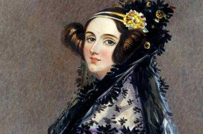

# Introduction

### 程序媛计划

“程序媛计划” 是斌叔发起的一个公益项目，目标是鼓励女性进入科技行业，让更多女性爱上编程。目前支持 [Web](https://www.cxy61.com/girl/decades-theme/index-image/index.html)、App 和微信小程序三种方式，可以让你随时随地免费地学习各种编程知识。

内容涉及：

- 计算机基础
- Linux 操作系统
- 数学
- Arduino
- C/C++ 语言
- Java 语言
- Python 语言
- Web 前端（HTML、CSS、JavaScript）
- Web 后端
- 数据分析
- 手机 App 开发
- 数据库
- 人工智能
- 游戏开发
- 儿童编程

### 第一位软件工程师

爱达·洛甫雷斯（Ada Lovelace，1815-1852 年）是英国著名诗人乔治·戈登·拜伦（George Gordon Byron）之女，原名奥古斯塔·爱达·拜伦（Augusta Ada Byron）。母亲安妮·伊莎贝拉·米尔班克（Anne Isabella Milbanke）是位业余数学爱好者，爱达没有继承父亲诗一般的浪漫热情，却继承了母亲的数学才能。

1830年，爱达和朋友成立了女学者联谊会，组织参观博物馆，拜访科学家等活动，此外，她们也谈论音乐、绘画等艺术，以及争取妇女受教育权与选举权等政治问题。正是因为这些活动，使爱达认识了被称为 “现代计算机技术之父” 的著名英国科学家查尔斯·巴贝奇（Charles Babage），并在后来对其笔记、手稿进行了整理和修正。

1835年，19岁的爱达嫁给了比她大11岁的绅士威廉，后来，丈夫被册封为洛甫雷斯伯爵，因此许多资料在介绍爱达将其称为 “洛甫雷斯伯爵夫人”（Countess of Lovelace）。爱达与丈夫的关系非常亲密，更值得庆幸的是，丈夫对她的工作也很感兴趣，给予她极大的支持。他们婚后生了三个孩子，由于爱达为了研究工作无暇照看，是其母亲帮助把孩子们抚养成人的，作为一名女性，这种行为在当时的英国遭到不少非议。

1842年，巴贝奇的朋友（意大利数学家路易吉·米那比亚）将其在差分机方面的工作集结为一本书稿，原稿是用意大利语写的，为了扩大影响力，爱达执意要动手将其翻译成英文。爱达的翻译工作做得异常出色，一年之后，她居然把 245 页纸的原稿 “翻译” 成为 542 页的著作，加进了自己所写的 297 页。巴贝奇发现，爱达不仅在著作中加入了她天才的想象，而且补充了许多独到的见解。她特别强调存储程序和数据的重要性，而这与今天的计算机技术不谋而合。爱达对计算机应用前景的展望，连巴贝奇也从来没想过。爱达认为，计算机应该发展成一个可用符号来表示任何事物的装置，她还预见到计算机可以绘图、演奏音乐，以及应用于其他科学领域。从某种意义上来说，爱达是世界上第一位计算机程序员。

爱达的形象完美地体现了一位程序员应该具备的科学家与艺术家的双重气质。一方面，程序员需要在数学概念、形式理论、符号表示等基础上工作，应该有科学家的素养。另一方面，对于一个高效的、可靠的、便于维护的软件系统，又必须刻画它的细节，并把它组成一个和谐的整体，所以程序员又应该有艺术家的气质。

